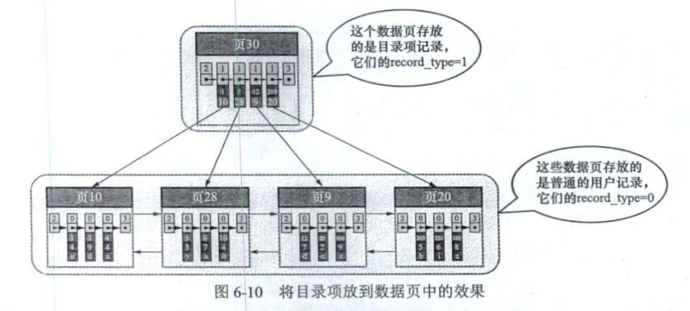
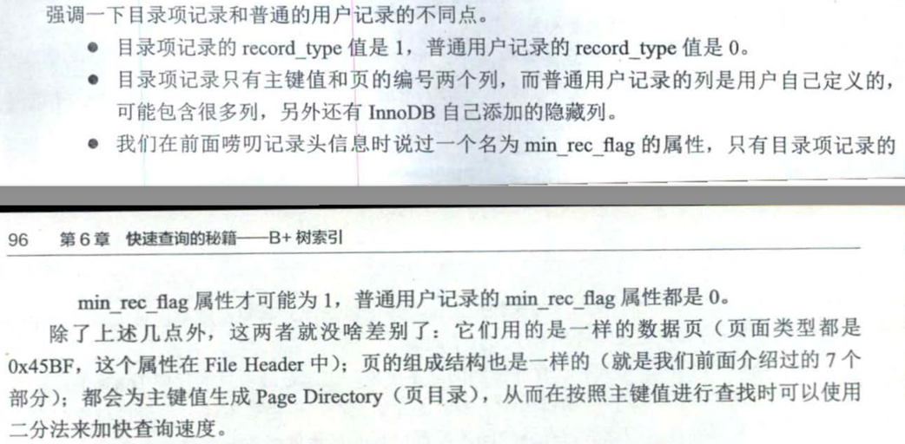

## 索引

### 索引的结构

一条索引数据其实也是一条记录数据，索引项也是记录项。

记录头信息中的 record_type属性，0表示是一条数据，1表示是一个索引

### 聚簇索引

包含以下两个方面的特征

（一）使用记录主键值的大小进行记录和页的排序

（1）页〈包括叶子节点和内节点〉内的记录按照主键的大小顺序排成一个单向链表，页 内的记录被划分成若干个组，每个组中主键值最大的记录在页内的偏移量会被当作 槽依次存放在页目录中(当然 Supremum记录比任何用户记录都大) ，我们可以在
页目录中通过二分法快速定位到主键列等于某个值的记录.

（2）各个存放用户记录的页也是根据页中用户记录的主键大小顺序排成一个双向链表 

（3）存放目录项记录的页分为不同的层级， 在同一层级中的页也是根据页中目录项记录 的主键大小顺序排成一个双向链表.

（二）B+树的叶子节点存储的是完整的用户记录.所谓完整的用户记录，就是指这个记录中 存储了所有列的值(包括隐藏列).

在 InnoDB 存储引擎中 ， 聚簇索引就是数据 的存储方式(所有的用户记录都存储在
了叶子节点) ，也就是所谓的"索引即数据，数据即索引 "

