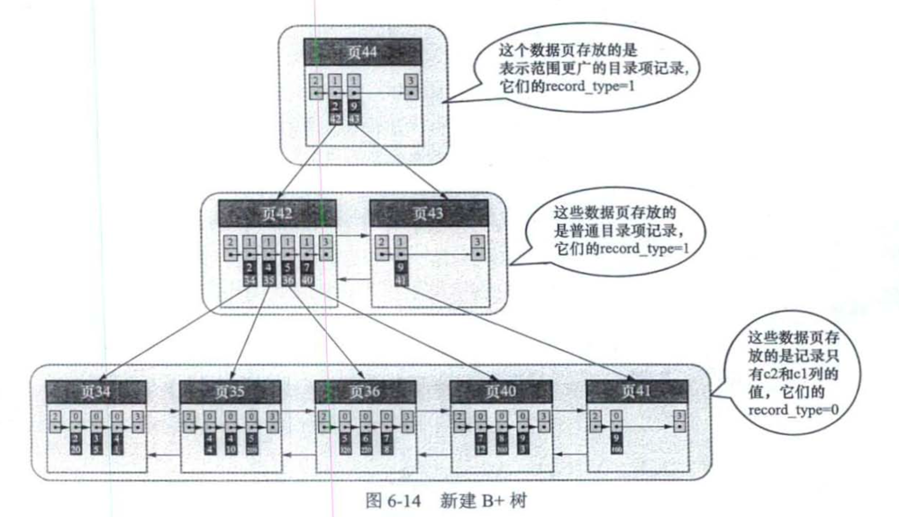
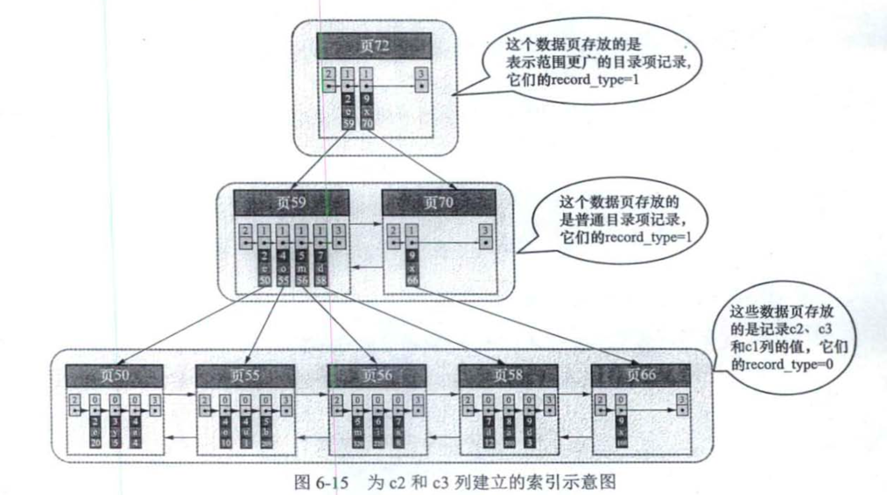

## 索引

### 索引的结构

一条索引数据其实也是一条记录数据，索引项也是记录项。

记录头信息中的 record_type属性，0表示是一条数据，1表示是一个索引

### 聚簇索引（即主键索引）

包含以下两个方面的特征

（一）使用记录主键值的大小进行记录和页的排序

（1）页〈包括叶子节点和内节点〉内的记录按照主键的大小顺序排成一个单向链表，页 内的记录被划分成若干个组，每个组中主键值最大的记录在页内的偏移量会被当作 槽依次存放在页目录中(当然 Supremum记录比任何用户记录都大) ，我们可以在
页目录中通过二分法快速定位到主键列等于某个值的记录.

（2）各个存放用户记录的页也是根据页中用户记录的主键大小顺序排成一个双向链表 

（3）存放目录项记录的页分为不同的层级， 在同一层级中的页也是根据页中目录项记录 的主键大小顺序排成一个双向链表.

（二）B+树的叶子节点存储的是完整的用户记录.所谓完整的用户记录，就是指这个记录中 存储了所有列的值(包括隐藏列).

在 InnoDB 存储引擎中 ， 聚簇索引就是数据 的存储方式(所有的用户记录都存储在
了叶子节点) ，也就是所谓的"索引即数据，数据即索引 "

### 非聚簇索引（也叫二级索引、辅助索引、非主键索引等）

我们可以多边几棵 B+ 树，并且不同 B+ 树中的数据采用不同的排序规则.比如 ， 我 们用 c2 列的大小作为数据页、页中记录的排序规则 ， 然后再建一棵 B+ 树 

结构和主键索引一摸一样，只是子节点存储的数据要少一些。

这个 B+ 树的叶子节点中的记录只存储了 c2 和 cl (也就是主键)两个列.在 这个 B+ 树的叶 子节点处定位到第 一条符合条件的那条用户记录之后，我们需 要根据该记录中的主键信息到聚簇索引中查找到完整的用户记录.这个通过携 带主键信息到聚簇索引中重新定位完整的用户记录的过程也称为回表.然后再 返回到这棵 B+树的叶子节点处，找到刚才定位到的符合条件的那条用户记录，
并沿着记录组成的单向链表向后继续搜索其他也满足 c2斗的记录，每找到一条 的话就继续进行回表操作 . 重复这个过程，直到下 一条记录不满足 c2斗的这个 条件为止.

### 联合索引

### 索引注意事项

1. 根页面万年不动窝， 一个 B+树索引的根节点自创建之日起便不会再移动 (也就是页号不再改变)
2. 内节点中目录项记录的唯一性。二级索引怎么做：为了让新插入的记录能找到自己在哪个页中 ， 就需要保证 B+树同一层 内节点的目录项记录除
   页号这个字段以外是唯一的. 我们把主键值也添加到二级索引内节点中 的目录项记录中，这样 就 能保证 B+ 树每
   一层节点中各条目录项记录除页号这个字段外是唯一的
3. 一个页面至少容纳2条记录

