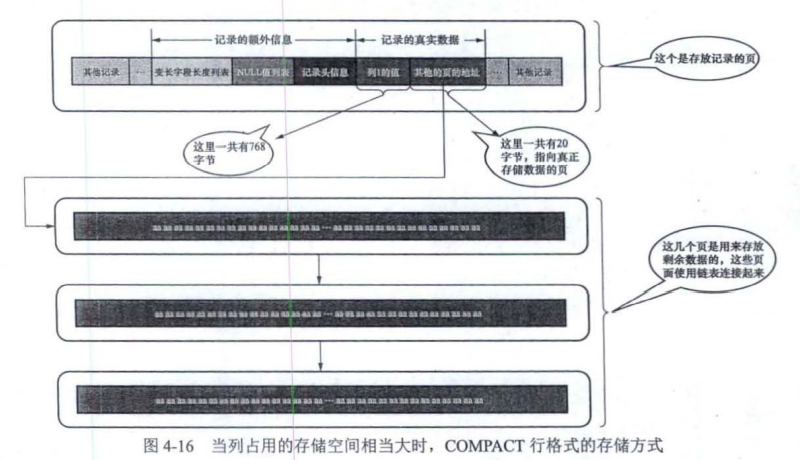
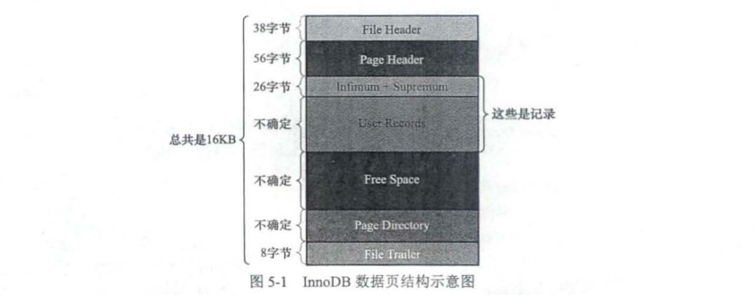
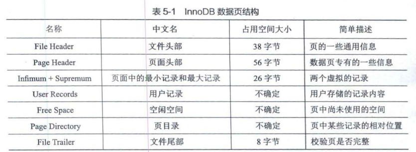

## 记录的存储结构和数据页的存储结构

### 记录的存储结构

我们平时都是以记录为单位向表中插入数据的，这些记录在磁盘上的存放形式也被称为行格式或者记录格式。到现在为止设计了 种不同类型的行格式，分别是 COMPACT、REDUNDANT、DYNAMI、COMPRESSED。

#### COMPACT 行格式

##### 记录额外信息

COMPACT 行格式中，所有变长字段的真实数据占用 字节数都存放在记录的开头位 置，从而形成 个变长字段长度列表，各变长字段的真实数据占用的字节数按照列 顺序逆序存放.

我们知道 一条记录中的某些列可能存储 NULL 值，如果把这些 NULL 值都放到记录的真实数据中存储会很占地方，所以 OMPACT 行格式把一条记录中值为 NULL 的列统一管理起来 ，存储到 NULL 值列表中.

记录头 信息由固定的 字节组成，用于描述记录的一些属性. 字节也就是 40 个二进制位 不同的 位代表不同的意思

对于表来说，记录的真实数据除了 c1 、c2.这几个我们自己定义 的列的数据外. MySQL 会为每个记录默认地添加一些列(也称为隐藏列)

InooDB 表的主键生成策略 优先使用用户自定义的主键作为主键，如果用户 没有定义主键 则选取一个不允许存储 NULL 值的山叫田键作为主键 如果表中连不允许存储 NULL值的 UNIQUE 键都没有定义，则恤oDB 会为表默认添加一个名为 row_id 隐藏列作为主键.

##### 溢出页

一个列的实际数据就需要占用 5532 字节，很显然一个页也存不了一条记录。而一个页的大小一般是 16KB，也就是 16384 字节。

对于占用存储空间非常多的列 ，在记录的真实 数据处只会存储该列的 部分数据，而把剩余的数据分散存储在几个其他的页中 然后在记录 的真实数据处用 20 字节存储指向这些页的地址(20字节还包括分散在其他页面中的 数据占用的字节数) ，从而可以找到剩余数据所在的页

### 数据页的存储结构

页是 InnoDB 管理存储空间的基本单位， 个页的大小 般是 InnoDB 为了不同的目的而设计了多种不同类型的页，比如存放表空间头部 的页、存放 Cbange Buffer 信息的页、存放的ODE 信息的页、存放 undo 日志信息的页; 等等.我们关心的是那些存放表中记录的那种类型的页，官方称这种存放记录的页为索引 INDEX 页。

#### 页结构

#### 记录在页中的存储

